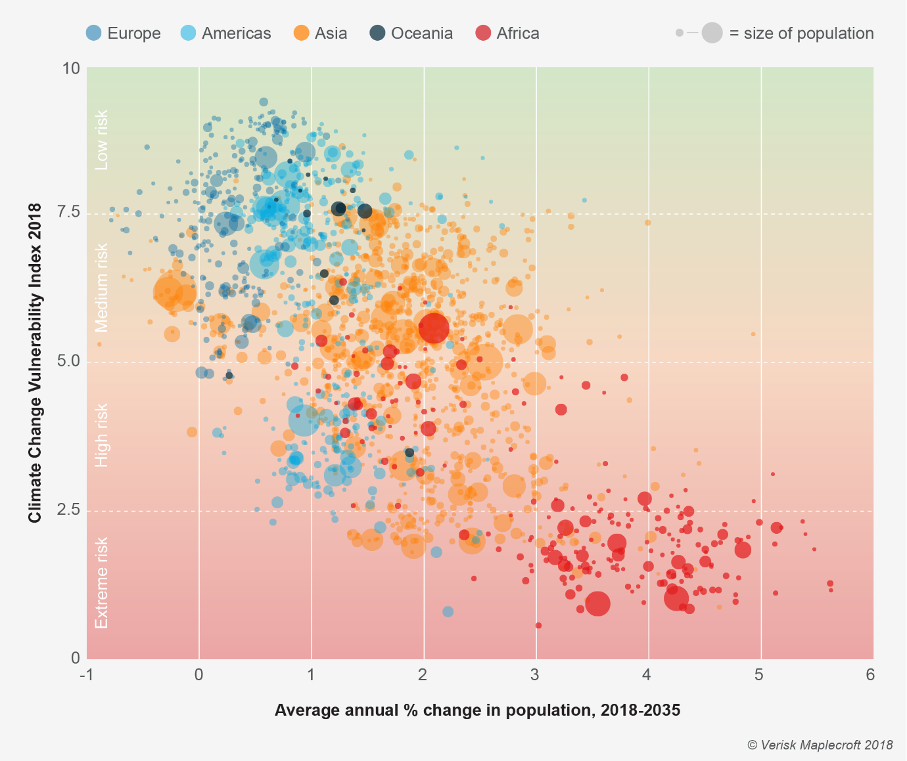
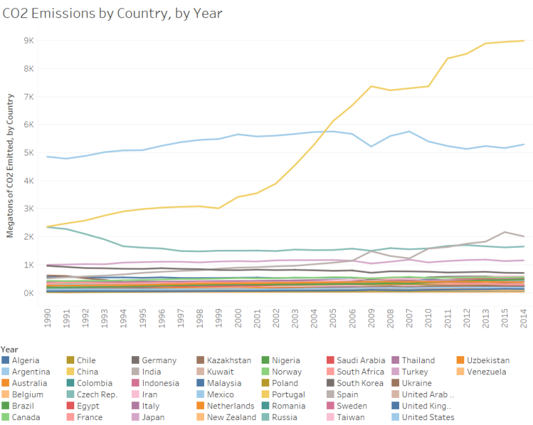
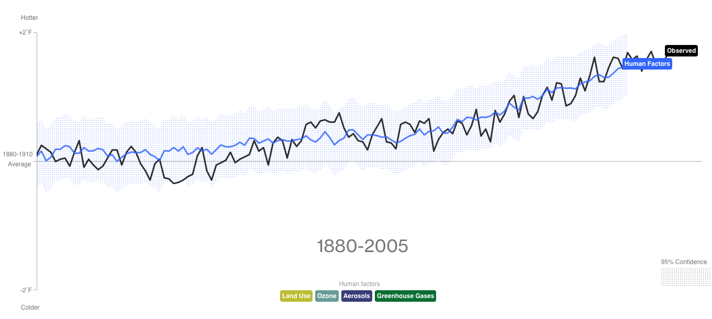
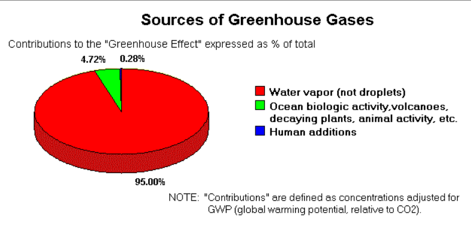
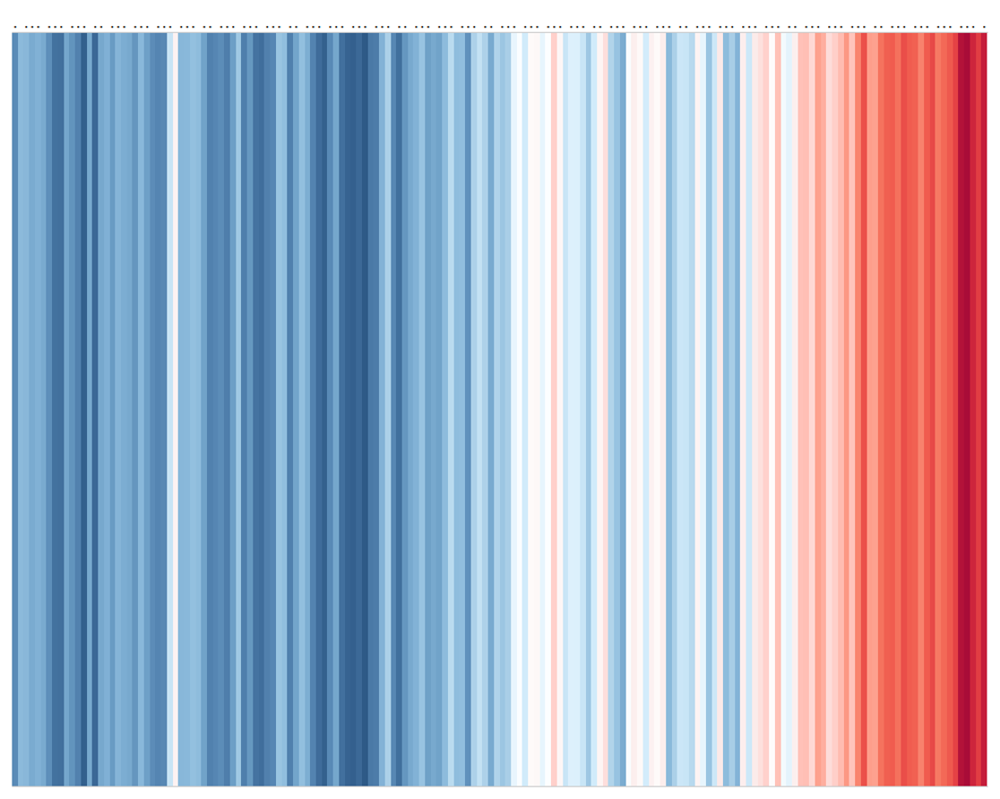

# PART 1

# *Introduction*
Data visualizatios are very helpful in obtaining useful insights and understanding the underlying distribution of the data. Successful data analysts leverage this powerful tool to effectively present their findings. It can also be used to detect anomalies and outliers in the data.Visualizations have to be done the proper way to successfuly communicate to the audience and convince them about the insights obtained. Hence it is a good practice to follow certain guidelines that will  help to create powerful visuals. 

# *Framework for what makes data visualization effective*

*	**Visuals must have useful end goals and insights**: Make sure visuals conclude something that is useful to the audience. We must construct visuals by focusing on what we want it to convey. 

* **Avoid misleading visuals**: It is a good practise to include zero baseline in our plot. If the axes don't start from 0, it will mislead the audience.

* **Keep your visualizations clear and to the point**: Primarily we have to keep the plot simple and try not to include information that isn't important. Avoid overloading the charts, if there are too many things going on in the chart, the audience won't be able to understand anything and the whole point is lost. Basically, don't overcomplicate the visual, make sure you understand what is to be achieved.
  
* **Titles/headers**: Keep chart titles simple, avoid making it too long. It needs to be clear as to what the chart really is. It should basically define the relationship between the variables of interest. Don't use interpretive language for the headings(for example: If "substantially"" is used in our header, then the audience might believe that the changes are substantial even though the plot shows us otherwise. Hence including such words will put the wrong idea in the audience's minds).

*	**Fonts**: Keep fonts simple as well. Don't distract the audience by using over the top fonts. If any message has to be conveyed, it is okay to use bold fonts or italics and such, but it isn't advisable to combine various things at once like using large, underlined, differnt fonts with many colours.

*	**Captions**: Use captions only if truly required to add more clarity to the visual, but should be avoided if it can mislead the audience.Hence use with caution. 

+ **Use the right charts**: Based on the data and the scenario that we want to visualise, we have to be sure to pick the appropriate chart. Pick a chart that will captivate the audience in the most effective way.
  -	**Use multiple charts for tall bars**: If some of the bars are really tall compared to the rest, it is advisable to use multiple charts. This will provide clear information about each of the bars,without omitting vital information.
  -	**Don't use 3D charts**: They are confusing and complicated, and it is very difficult to interpret 3D visualizations as there are too many things going on in these charts.
  -	**Avoid pie charts**: When you have a lot of things to compare, using a pie chart isn't advisable as it can get cluttered and messy. Even if there are not many categories to compare, there are better alternatives to pie charts like a bar graph. Bar graphs are more intuitive, and they help to better compare the categories than a pie chart. Hence in general pie charts can be avoided.
  -	**Replace stacked chart with line chart if possible**: Stacked charts are difficult to understand completely, hence line charts can be used instead. Again, our main goal is to make the audience understand the graph,but using stacked graphs can cause unneccessary confusion as it isn't as easy to intrepret stacked graphs as compared to line charts.

*	**Make sure x and y axis scales are present**: If not present then the audience will find it difficult to understand what the visual is trying to convey.  

+ **Ordering of data**:
  -	Order alphabetically, by value or sequentially. This keeps the visuals neat and easy to interpret.
  - Don't let the values in our axis overlap as it won't be possible to read them.
  -	Change the value's positioning to vertical, if the labels aren't visible in the x axis, alternatively we can rotate the chart if they are too long and overlapping. (for example, bar charts can be inverted in this case,which places the long lables in the y axis that displays it clearly)
  -	Ordering in legends should be same as the order present in our plot.
  -	Don't use uneven increments on your axes. Also, avoid using inconsistent scales. For example, if your scale is 2011, 2012, 2013, 2014Q1, 2014Q2, 2014Q3, 2014Q4. Here 2014 is divided according to the quarters which leads to inconsistency in our axes.
  
+ **Labels**:
  -	Labels for each axis must be present in our visuals.
  -	Make sure the labels are clear and not too long. 
  -	Use direct labelling . For example, in a line chart, towards the end of each line we can provide labels, instead of indicating what each line means somewhere else.
 
*	**Perform all the calcutions and visualize it**: The audience will find it hard to follow if we expect them to further perform some calculations and obtain insights from that. Instead, we must do all the calculations ourselves and visualise it in our plot.

+ **Be careful when using colours**: Colours are very useful for creating effective visuals, but  overdoing it can lead to many ambiguities.
  - Same colours have to be used for the same kind of data. Depending on the scenario, we have to pick the right colours for the information we want to convey. For example, when comparing last year's sales to this year's sale, use different colour for each year.
   -	Colours have to be selected appropriately as some colours will give unnecessary weight to the data. 
  -	Adding to the above point,be careful when using colours for positive and negative numbers.In our scenario if positive numbers are better than obtaining negative numbers,then use green for positive and red for negative(or any colour that will clearly indicate positives and negatives) . But if higher the number,the worse it is,then use red for postives and green for negatives. 
  -	Use colours that are contrasting to clearly understand the differences between what we are trying to show. If similar colours are used, it will be hard to know where one thing stops and where the other starts. At the same time don't use too over contrasting colours. 
  -	Don't use more than 6 colours. Too many colours are too distracting and will stray away from the point we are trying to make.
  
*	**Make sure your visualization is accessible**: Our visuals must be accessible for future modifications. It must also be easy to use and scalable.
  
*	**Try the squint test**:The test is to squint your eyes facing the plot from a distance. If we can still get an idea about the general body of the plot, then we are doing something right regarding the visuals.

References:
1. https://www.eea.europa.eu/data-and-maps/daviz/learn-more/chart-dos-and-donts
2. https://www.columnfivemedia.com/25-tips-to-upgrade-your-data-visualization-design
3. https://web.archive.org/web/20030402093134/http://www.sao.state.tx.us/Resources/Manuals/Method/data/12DECEPD.pdf
4. https://guides.library.duke.edu/datavis/topten 
5. https://blog.k2datascience.com/the-five-indispensable-rules-of-data-visualization-1119424bad14
6. https://www.dummies.com/programming/big-data/big-data-visualization/what-makes-good-data-visualization/

# *Five visualization charts*
## Figure 1:

https://visme.co/blog/climate-change-facts/
* Figure 1 is a scatter plot that talks about the probability of climate change as the population gets larger. 
* We see that Africa has the highest risk of climate change while Europe has the lowest.
* According to the framework, a title or header is required to help the audience understand exactly what the visual is attempting to convey. This is missing from the visual.
* And the colours of Europe and America are very similar, hence it would be more effective to show proper difference between the two by using contrasting colours.
* Ordering of data is also very important, usually we would expect the y axis to start from low risk to extreme risk. This might confuse the audience as they would at a glance guess that Europe has higher risk as it is higher up in the chart. Adding to that, the y axis values are confusing as you would normally expect a lower number to have a lower risk.  So, I would suggest to change the order of the y axis, and label the y axis in terms of the risk and not the climate change vulnerability index, because the general audience wouldn’t necessarily understand what a vulnerability index is.
* Therefore, handling these can further improve the plot and generate a more compelling visual.

## Figure 2:

https://environmentaldatavisuals.wordpress.com/2016/10/16/visuals-only-co2-efficiency-and-emissions-by-country-over-time/
* The above image is a line chart that depicts the carbon dioxide emissions for a few countries, and from 1990 to 2014. This chart can help us identify the countries having the highest CO2 emissions(certainly due to human causes), which is one of the main reasons for climate change.
* A visual can be effective if it is clear and simple. But this plot has too many variables and hence the information about a lot of countries aren't clear at all (all we can say is that many of the countries are emitting 0 to 1000 megatons of CO2, but it isn’t clear which ones and exactly how much is being emitted).
* Knowing the end goals of the visual is very important as given by the framework. If the audience is just looking for, let’s say top 5 countries emitting a lot of CO2, then we can eliminate clutter by just having 5 lines for the top 5 countries in our plot. But if they want information about all the countries, I would suggest to use mulitple line charts with different scales that will clearly show all the lines represting each country.
* And it’s not advisable to use more than six colours in a single plot.However, more than 40 colours are used for each of the lines. Hence, we can’t distinguish between the countries with confidence. The colours in figure 1 were definitely more distinguishable compared to this figure. 
* Incorporating these changes can create a more powerful plot.
 
## Figure 3:

https://www.epa.gov/climate-indicators/climate-change-indicators-climate-forcing
* This stacked graph shows the heating effect caused by greenhouse gases. This graph tells us that climate change is due to the substantial increase in the greenhouse gases throughout the years. 
* According to the framework, stacked charts aren’t very clear to understand. Instead line charts can be used. Line charts are understood by all and can be a more effective way of conveying the same information.
* Also the colours used aren't very appropriate for what they're trying to convey. In this figure carbon dioxide has been given green. Green colour is usually associated with being safe or good, and red for being unsafe or bad. But here we see that carbon dioxide is increasing at an alarmingly high rate which is clearly not good. Hence the colours don't really match with what the visual is trying to convey. 

## Figure 4:

https://www.bloomberg.com/graphics/2015-whats-warming-the-world/
* This line graph depicts the relationship between actual increase in temperature versus the increase in temperature due to human factors. We can see clearly from this that human factors are causing the increase in temperature.
* But according to the framework, a title is required and defining the y axis clearly instead of just giving 1880-2005.
* But I think this is a very good and effective graph, it is clear and it conveys the message clearly. It follows the framework almost perfectly. It shows the average temperature, and how much higher the temperature actually is compared to that. Basically, it does a good job at convincing the audience of the impact that humans have on climate change.

## Figure 5:

https://www.geocraft.com/WVFossils/greenhouse_contrib.html
* This figure argues that global warming by greenhouse effect( which is the main reason for climate change) is due to water vapour, but human factors are very insignificant.
* First thing I noticed is that the pie chart doesn't do a good job at showing human contributions at all. Even though it is present,it is barely visible.The framework did say that pie chart is better to be avoided. Therefore I would suggest to change this to a bar chart which will effectively compare the three factors, and the human factor bar will be visible (even if the bar is really short, it will be more visible than in the pie chart).
* The framework also mentioned not to use 3D graphs in any case, as it is unnecessary and simply complicates the visual. The audience might think the height of the pie chart has some significance when infact it doesn't. Therefore 3D graphs are to be avoided.

# *Conclusion*:
From all the above evaluations, we can see the importance of creating powerful visuals that follows the framework. The main goal is to convince the audience of the story that the visuals are trying to tell. It has to be clear and to the point. If the above framework is followed thoroughly, then achieving this is definetly possible.

# PART 2

# *Replication of warming stripes*

